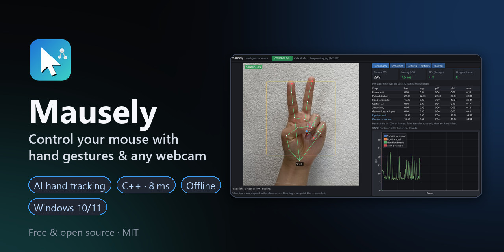
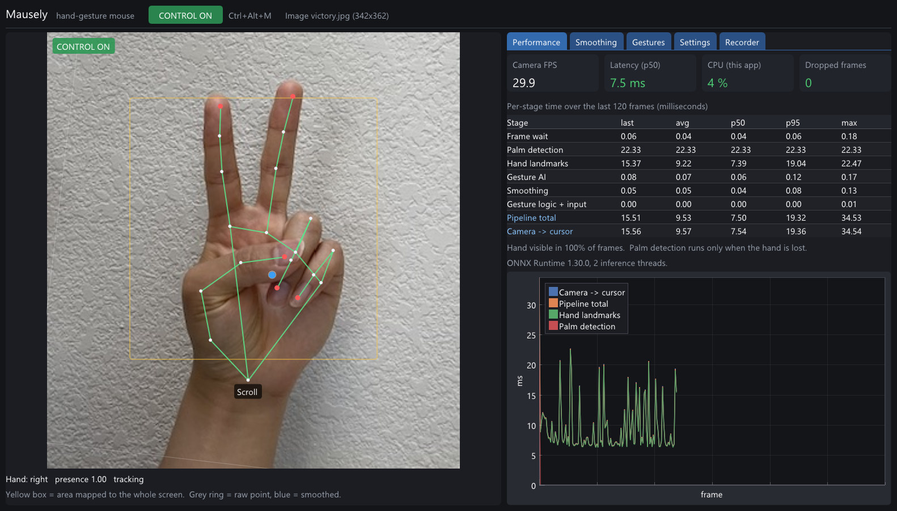
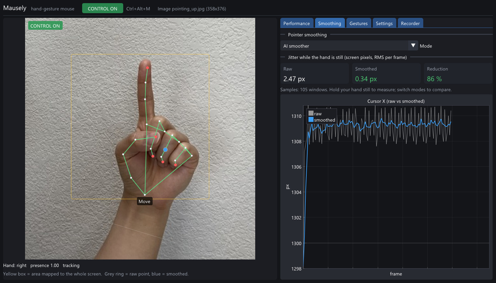
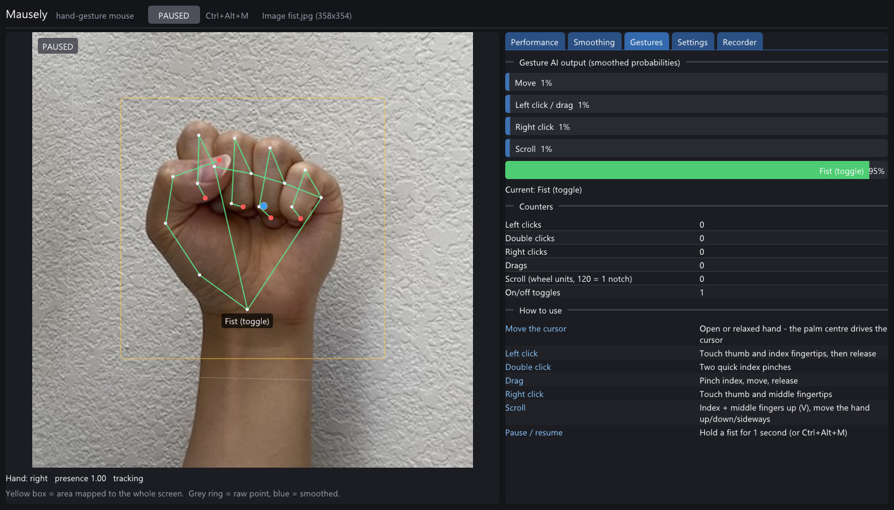
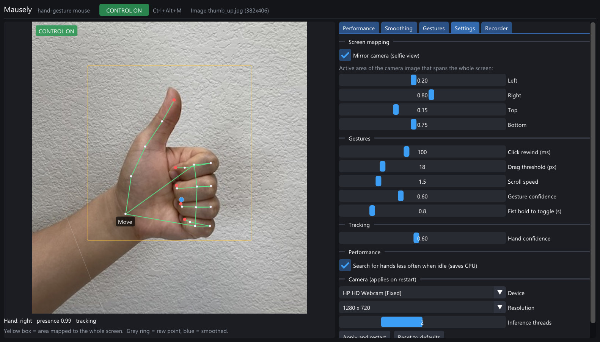

<p align="center">
  
</p>

<h1 align="center">Mausely – AI Hand Gesture Mouse for Windows</h1>

<p align="center">
  <b>Control your computer with hand gestures using any webcam.</b><br>
  A free, open-source, touchless <b>virtual mouse</b> written in C++ with on-device AI hand tracking.<br>
  Runs fully offline on the CPU, and needs only about 8 ms per frame even on a 2012 laptop.
</p>

<p align="center">
  <a href="https://github.com/mahdidigitalx-oss/mausely/actions/workflows/ci.yml"></a>
  <a href="https://github.com/mahdidigitalx-oss/mausely/releases/latest"></a>
  <a href="LICENSE"></a>
  
  
  
</p>

<p align="center">
  <a href="#-download-and-quick-start">Download</a> ·
  <a href="#-gestures">Gestures</a> ·
  <a href="#-screenshots">Screenshots</a> ·
  <a href="#-how-it-works">How it works</a> ·
  <a href="#-build-from-source">Build</a> ·
  <a href="#-faq">FAQ</a> ·
  <a href="https://mahdidigitalx-oss.github.io/mausely/">Website</a>
</p>

---

Mausely turns your webcam into a **hand-tracking mouse**: move the pointer with your palm, click
by pinching your fingers, scroll with a V sign, and pause with a fist. It is built for people who
want **touchless computer control** for accessibility, presentations, kitchens and workshops, or for
controlling a PC from the sofa. It is also a clean reference project for **real-time hand gesture
recognition in C++** with MediaPipe models and ONNX Runtime.

## ✨ Highlights

- **Works with any webcam.** No depth camera, Leap Motion or special hardware needed.
- **Real-time and lightweight.** Native C++20 with no Python at run time. On a 2012 i7 laptop the
  hand is tracked in about 8 ms per frame, and the gesture AI and smoothing together take under 0.2 ms.
- **Seven mouse actions:** move, left click, double click, drag and drop, right click, vertical and
  horizontal scroll, and pause/resume.
- **Custom AI for accuracy and a steady cursor:**
  - A 7.5k-parameter gesture classifier reached 99.6% on held-out synthetic test data and got all 7
    real test photos right.
  - A learned motion smoother cuts cursor jitter by 65% on synthetic test tracks without adding lag.
    It beats a tuned One Euro filter on both error and jitter.
- **Precise clicks.** The click lands where the cursor was about 100 ms before the pinch, so pinching
  doesn't drag the pointer off the button. Double clicks snap to the first click, and a hand that
  enters the frame already pinched never clicks.
- **Live statistics dashboard.** Camera view with the tracked hand skeleton, per-stage timings
  (avg / p50 / p95 / max), end-to-end latency, CPU usage, jitter before and after smoothing,
  gesture probabilities and click counters.
- **Private by design.** Everything runs locally, nothing is uploaded, and no images are stored.
- **Personal fine-tuning.** Record your own hand in the dashboard and retrain the gesture model in
  a few minutes on a CPU.
- **Safe defaults.** The app starts paused. `Ctrl+Alt+M` toggles control at any time, and buttons are
  released automatically when the hand leaves the frame.

## 🚀 Download and quick start

1. Download **`Mausely-x.y.z-win64.zip`** from the [latest release](https://github.com/mahdidigitalx-oss/mausely/releases/latest).
2. Unzip it anywhere; no installation or admin rights are needed. Run **`mausely.exe`**.
3. Show your open palm to the camera, then press **`Ctrl+Alt+M`** (or hold a fist for 1 second) to start
   controlling the mouse.

**Requirements:**
- Windows 10 or 11 (64-bit) and any USB or built-in webcam.
- The [Microsoft Visual C++ 2015–2022 Redistributable (x64)](https://aka.ms/vs/17/release/vc_redist.x64.exe),
  which most PCs already have.
- No GPU and no internet connection needed.

> Tip: good, even lighting matters more than camera resolution. In dim light many webcams drop
> from 30 to 15 fps.

## ✋ Gestures

| Mouse action | Hand gesture |
|---|---|
| **Move the cursor** | Open or relaxed hand. The palm centre drives the pointer, so it does not jump when you pinch |
| **Left click** | Touch the thumb and index fingertips, then release |
| **Double click** | Two quick index pinches; the second one lands exactly on the first |
| **Drag and drop** | Pinch with the index finger, move, release |
| **Right click** | Touch the thumb and middle fingertips |
| **Scroll** | Raise index and middle fingers (V sign) and move the hand up/down (or sideways for horizontal scroll) |
| **Pause / resume** | Hold a fist for 1 second, or press `Ctrl+Alt+M` |

The yellow box in the camera view is the part of the image that maps to your whole screen (all
monitors). You can resize it in **Settings**, so small hand movements can cover a large display.

## 📸 Screenshots

<p align="center">
  
  <br><sub>Live hand tracking (V sign detected as <i>Scroll</i>) with per-stage timings: 7.5 ms from frame to mouse event.</sub>
</p>

<table>
  <tr>
    <td width="50%"><br><sub><b>Smoothing</b>: the AI smoother removed 86% of the cursor jitter on a still hand.</sub></td>
    <td width="50%"><br><sub><b>Gestures</b>: live AI probabilities and counters. A held fist pauses control.</sub></td>
  </tr>
  <tr>
    <td width="50%"><br><sub><b>Settings</b>: active area, click rewind, drag threshold, scroll speed and camera.</sub></td>
    <td width="50%">
      <b>Also in the dashboard</b><br><br>
      • <b>Recorder</b> tab to collect training data from your own hand<br>
      • CPU usage, dropped frames and camera FPS<br>
      • Raw vs smoothed cursor plots<br>
      • Switch smoothing live: raw, One Euro, AI, AI + prediction<br><br>
      <sub>Screenshots were rendered with <code>mausely.exe --image &lt;photo&gt; --screenshot</code> using MediaPipe test photos.</sub>
    </td>
  </tr>
</table>

## 📊 Performance

These are the measured times on the reference machine: an Intel Core i7-3740QM (2012, 4 cores,
no AVX2) with a built-in 720p webcam, running on the CPU only.

| Pipeline stage | Time per frame (p50) |
|---|---|
| Hand landmarks (tracking an already found hand) | ~7–8 ms |
| Palm detection (runs only when the hand is lost) | ~16–22 ms |
| Gesture AI (features + neural network) | 0.06 ms |
| AI smoother | 0.04 ms |
| Gesture logic + `SendInput` | < 0.01 ms |
| **Frame arrival → mouse event** | **~7.5–12 ms** |

After 2 seconds without a hand, Mausely searches less often to save battery. You can reproduce these
numbers without touching your mouse:

```bat
mausely.exe --benchmark 300
```

## 🧠 How it works

```
 capture thread        processing thread                                      UI thread
 ┌────────────┐ latest ┌────────────────────────────────────────────────────┐ ┌──────────────┐
 │ MediaFound.│ frame  │ HandTracker: palm detector ⇄ landmark tracking     │ │ Win32 + D3D11│
 │ webcam     │──────▶ │ → invariant features → gesture MLP (ONNX)          │▶│ Dear ImGui + │
 │ or image   │        │ → smoother (raw / One Euro / AI / AI + prediction) │ │ ImPlot       │
 └────────────┘        │ → gesture state machine → SendInput                │ └──────────────┘
                       └────────────────────────────────────────────────────┘
```

1. **Capture.** Media Foundation reads the webcam in low-latency mode. Only the newest frame is
   processed, so latency never piles up.
2. **Hand tracking.** The MediaPipe palm detector finds the hand. After that, the 21-point hand
   landmark model follows it from frame to frame, which is the same detect/track scheme MediaPipe
   uses. Both models run through ONNX Runtime, which is loaded at run time, so any compiler can
   build the app.
3. **Gesture recognition.** 81 features are computed from the 3D landmarks: joint angles, fingertip
   distances, finger spread, and the hand shape in its own frame. They do not change with position,
   rotation, hand size, or left vs right hand. A tiny MLP classifies them into *move, pinch-index,
   pinch-middle, scroll* or *fist*.
4. **Smoothing.** A second tiny network sees the last 16 pointer positions and removes tremor and
   landmark jitter without adding lag.
5. **Gesture state machine.** Hysteresis on the probabilities, click rewind, drag threshold,
   double-click snapping, scroll accumulation and the fist toggle. Button releases are guaranteed.
   The result goes to Windows through `SendInput`, so the cursor moves correctly across multiple
   monitors and DPI settings.

### The two small AI models

Both models are trained on **procedurally generated data** with PyTorch: no third-party dataset and
no dataset licence. They are exported to ONNX and ship in [`models/`](models).

| Model | Architecture | Trained on | Result |
|---|---|---|---|
| `gesture_mlp.onnx` | MLP 81→64→32→5 (7.5k params) | Kinematic hand model with proportions measured from real MediaPipe output, per-class joint ranges, inverse kinematics for the thumb in pinches, noise and mirroring | **99.6%** on held-out synthetic hands, **7/7** real test photos ([report](models/gesture_report.json)) |
| `smoother.onnx` | MLP 33→128→64→4 (12.9k params) | Human-like pointing: minimum-jerk reaches with Fitts-law timing, dwells, pursuit, 8–12 Hz tremor, correlated jitter and outliers, at 15–60 fps | Beats a tuned One Euro filter ([report](models/smoother_report.json)) |

Smoother vs One Euro on held-out trajectories (30 fps, pixels of a 720p frame; lower is better):

| Method | Error | Jitter when still | Lag |
|---|---|---|---|
| Raw landmarks | 2.26 | 2.62 | 0 ms |
| One Euro filter (lowest-error tuning) | 2.12 | 1.69 | 0 ms |
| One Euro filter (tuned to match the AI's steadiness) | 2.87 | 0.83 | 8 ms |
| **Mausely AI smoother** | **1.89** | **0.92** | **0 ms** |

### Make the gesture AI learn *your* hand

1. In the dashboard, open **Recorder**, pick a gesture and press **Record**. Hold the pose while
   moving and turning your hand; a minute per gesture helps a lot. Only landmark coordinates are
   saved, never images.
2. Retrain:
   ```bash
   cd training
   python -m mausely_train.train_gestures --recordings "%APPDATA%\Mausely\recordings"
   ```
3. Copy the new `models/gesture_mlp.onnx` into the `models` folder next to `mausely.exe` and restart.

## 🔧 Build from source

Requirements: Windows 10/11 x64, CMake ≥ 3.24, Ninja, and a C++20 compiler. The project is built in
CI with GCC ([w64devkit](https://github.com/skeeto/w64devkit), which is portable and needs no admin
rights) and with MSVC 2022.

```bash
git clone https://github.com/mahdidigitalx-oss/mausely.git
cd mausely
cmake --preset default
cmake --build build
ctest --test-dir build --output-on-failure
build\bin\mausely.exe
```

The first configure downloads and SHA-256-verifies Dear ImGui, ImPlot, stb_image, doctest, the ONNX
Runtime headers and DLL, and the MediaPipe hand models. They are cached in `.deps/`.
To build a portable release zip, run `powershell -File scripts\package.ps1`.

### Command-line options

| Option | Description |
|---|---|
| `--camera N` | Use camera number N |
| `--image photo.jpg` | Use a still image instead of the webcam (testing, demos) |
| `--benchmark N` | Process N frames headless and print timing statistics; never moves the mouse |
| `--screenshot out.bmp [--tab N]` | Render the dashboard for 4 s, save it and exit |

### Project layout

| Folder | Contents |
|---|---|
| [`src/vision`](src/vision) | ONNX Runtime wrapper, image ops, palm detector, landmark model, tracker |
| [`src/ai`](src/ai) | Invariant hand features, gesture classifier, One Euro filter, AI smoother |
| [`src/control`](src/control) | Gesture state machine, cursor mapping, `SendInput` |
| [`src/capture`](src/capture) | Media Foundation webcam capture, still-image source |
| [`src/pipeline`](src/pipeline) | Threads, settings file, snapshots for the UI |
| [`src/ui`](src/ui) | Direct3D 11 window and the ImGui/ImPlot dashboard |
| [`training/`](training) | Python: hand model, data generators, training, ONNX export, tests |
| [`tests/`](tests) | C++ unit and integration tests, including C++/Python parity checks |
| [`docs/design`](docs/design) | Design document and implementation plan |

## 🔒 Privacy

Mausely makes **no network connections** at run time and **never saves camera images**.
Settings (`settings.ini`), the log and optional gesture recordings (landmark numbers only) are stored
in `%APPDATA%\Mausely`.

## ❓ FAQ

<details>
<summary><b>How do I control my mouse with hand gestures on Windows?</b></summary>

Download Mausely, run `mausely.exe`, show your palm to the webcam and press `Ctrl+Alt+M`. Move your
open hand to move the cursor, pinch thumb and index finger to click, and make a V sign to scroll.
</details>

<details>
<summary><b>Does it need a GPU, a special camera or an internet connection?</b></summary>

No. Everything runs on the CPU with a normal webcam, fully offline. It was developed on a
2012 laptop without AVX2 support.
</details>

<details>
<summary><b>How is this different from Python/OpenCV "virtual mouse" scripts?</b></summary>

Mausely is a native C++ application, not a script:
- It runs about 8 ms per frame with no Python at run time.
- A learned smoother gives a steady cursor.
- Clicks don't move the pointer, thanks to click rewind and palm-centre tracking.
- It supports drag, double click, right click and horizontal scroll.
- It includes a statistics dashboard, safe defaults, and a way to fine-tune the AI on your own hand.
</details>

<details>
<summary><b>Does it work for left-handed users?</b></summary>

Yes. The gesture features don't depend on which hand you use, so left and right hands are
recognised the same way.
</details>

<details>
<summary><b>Can it control admin windows or games?</b></summary>

Windows blocks simulated input into programs running as administrator (for example Task Manager),
unless Mausely itself is run as administrator. Some games and anti-cheat systems ignore simulated
mouse input.
</details>

<details>
<summary><b>Is it accurate enough for everyday use?</b></summary>

The screen mapping, click rewind, drag threshold and smoothing can all be tuned live. For small
targets, shrink the active area. If a gesture is misread with your hand or camera, record a minute of
it and retrain; the gesture network was trained on synthetic hands only and improves most with your
own data.
</details>

## 🗺️ Roadmap

- [ ] Optional GPU acceleration (DirectML)
- [ ] System-tray mode and start with Windows
- [ ] Installer / `winget` package
- [ ] Per-application profiles and configurable gesture mapping
- [ ] Two-hand gestures (zoom, rotate)

Ideas and pull requests are welcome. See [CONTRIBUTING.md](CONTRIBUTING.md).

## 🤝 Contributing

Bug reports with the output of `mausely.exe --benchmark 300` and your camera model help the most.
[Open an issue](https://github.com/mahdidigitalx-oss/mausely/issues) or read the
[contributing guide](CONTRIBUTING.md) for build, test and training instructions.

## 📄 License and credits

Mausely is released under the **[MIT License](LICENSE)**. © 2026 mahdidigitalx-oss and Mausely contributors.

Mausely builds on excellent open-source work:
- The hand palm detection and landmark models are Google's [MediaPipe](https://github.com/google-ai-edge/mediapipe)
  models (Apache-2.0), in the ONNX conversion by [OpenCV Zoo](https://github.com/opencv/opencv_zoo).
- [ONNX Runtime](https://github.com/microsoft/onnxruntime) (MIT) runs all the models.
- [Dear ImGui](https://github.com/ocornut/imgui) and [ImPlot](https://github.com/epezent/implot) (MIT)
  power the dashboard.
- [stb_image](https://github.com/nothings/stb) and [doctest](https://github.com/doctest/doctest) are used
  for image loading and tests.

The full list, with licences, is in [THIRD_PARTY_NOTICES.md](THIRD_PARTY_NOTICES.md). The hand photos in
the screenshots are MediaPipe test assets (Apache-2.0).

<p align="center"><sub>If Mausely is useful to you, please ⭐ star the repository so others can find it.</sub></p>
